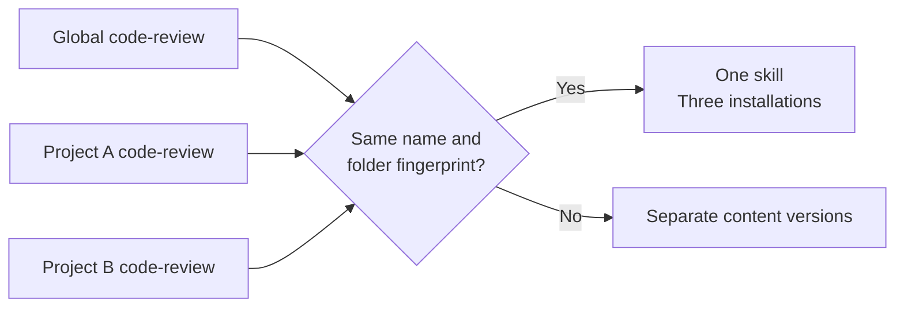
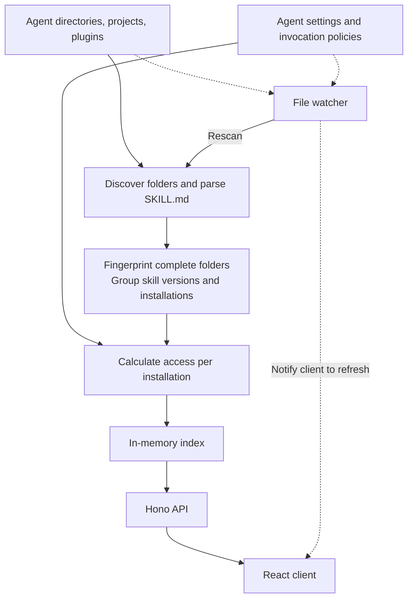
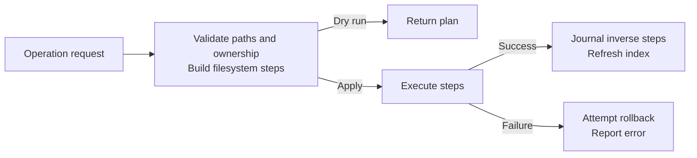

**A local library for AI coding-agent skills.**

Skillet discovers skill folders, groups identical copies into one skill, tracks which agents can read each installation, and manages their files and configuration. It runs on your machine with Bun, Hono, and React. There is no database or account requirement.

Built-in support is focused on **Claude Code, Codex, Cursor, OpenCode, and Pi**. These five share the same discovery, editing, and transfer workflows, with agent-specific policy handling where supported. Other tools are not automatically added to the inventory or bulk installation targets. Explicitly configured custom agents remain available for directory discovery and transfers.

## The problem

Using several coding agents spreads skills across global directories, projects, and plugins. A `code-review` skill copied into three places is still one set of instructions, but a directory listing makes it look like three skills. Later, one copy changes, a link breaks, or an agent setting disables an installation. Knowing that a folder exists no longer tells you which version an agent can use.

Skillet separates **skill identity** from **installation location**. Equal names and equal complete folder content form one entry; each installation keeps its own path, scope, ownership, and agent access. Different content remains a separate version, even when the name matches.



This grouping does not move or synchronize files. You can leave installations where they are, copy independent versions, or deliberately consolidate global copies into the hub and link agents to it. A fingerprint includes supporting scripts and assets, not just `SKILL.md`.

Skillet is useful when you need to understand and maintain an existing collection across agents and repositories. If you only need to install a few skills into one agent, a CLI or the agent's own folders may be enough.

## Run

Use Bun 1.3.14 or newer and Node.js 24 for development and quality tooling. Bun runs the API; the current toolchain also includes Node-based executables.

```sh
git clone https://github.com/Paul-M-Kallarackal/skillet.git
cd skillet
bun install
bun run dev
```

Open **http://localhost:5180**. The API listens on `127.0.0.1:5181`.

Global skill directories and enabled Claude Code plugins are scanned automatically. Add your project roots in Settings to include repository skills. First startup creates Skillet's configuration and hub if needed.

## Functionality

- **Inventory:** one entry per skill name and complete content version, even when installed globally, in multiple repositories, or through a plugin. Every installation retains its path, scope, and agent access.
- **Content:** inspect and edit `SKILL.md`; rename skills; select a particular installed copy. Editing an independent copy can create a separate content version.
- **Availability:** copy or link skills into agent directories, remove an installation, and adjust invocation settings. Copying makes independent files; linking shares one source. All agents copies to the five built-in agents and any explicitly configured custom agents, preserving occupied destinations.
- **Hub adoption:** consolidate global copies into the hub, with backups and links from the original locations. Project and plugin installations stay where they are.
- **Find skills:** search skills.sh, review a commit-pinned GitHub snapshot, then import the selected folder into the hub. Agent installation is a separate action.
- **Share:** copy the skill name, description, and instructions as Markdown or plain text. Supporting files are not included in clipboard sharing.
- **Trash and history:** restore trashed installations. The API records reversible operations in a journal and can undo the latest entry. Permanent purge cannot be undone.

Availability is an estimate from local folders and supported configuration. Skillet does not execute skills or verify that a running agent has loaded them. See [agent compatibility](docs/agent-compatibility.md).

Inventory agent icons and filters respect disabled access for each installation. If another copy remains enabled for an agent, the skill still appears as available to that agent.

## How the code works

The filesystem is the source of truth. The server builds an in-memory index; the web client reads it through the API.



The main entry points are [`scan/scanner.ts`](apps/server/src/scan/scanner.ts) for discovery, [`scan/index-builder.ts`](apps/server/src/scan/index-builder.ts) for grouping, and [`visibility/visibility.ts`](apps/server/src/visibility/visibility.ts) for access rules. Filesystem operations live under [`hub/`](apps/server/src/hub); catalog search and imports live under [`catalog/`](apps/server/src/catalog).

Most mutations use a filesystem step plan, with optional dry-run inspection and an inverse recorded for undo:



Rollback can be incomplete if filesystem recovery fails. Permanent trash purge has no inverse. See the [architecture and code map](docs/architecture.md) for operation boundaries, import validation, routes, and undo behavior.

## Data and configuration

Skillet owns these paths by default:

| Path | Purpose |
|---|---|
| `~/.skillet/config.json` | Scan roots, hub location, discovery options, custom agents |
| `~/.skillet/hub/` | Central skill storage |
| `~/.skillet/trash/` | Removed installations and restore manifests |
| `~/.skillet/journal.jsonl` | Applied operations and undo steps |

Agent skills remain ordinary directories containing `SKILL.md` and optional scripts, references, and assets. Grouping identical content does not move, delete, or synchronize those directories.

The server checks local origins and requires `x-skillet-client: skillet-web` on mutation requests. It is intended for local use. Plugin installations are read-only; make an independent copy to edit their content.

## Development

### Why these tools exist

| Tool | Role in Skillet | Example of what it catches or does |
|---|---|---|
| [Bun](https://bun.sh/docs/runtime) | Installs dependencies, runs the Hono server and scripts, and runs unit tests | Executes TypeScript; tests grouping, filesystem transfers, and undo using `bun:test` |
| [Playwright](https://playwright.dev/docs/intro) | Runs browser flows in Chromium at desktop and mobile sizes | Broken filters, dialogs, clipboard sharing, request payloads, or layout behavior |

[Bun's built-in test runner](https://bun.sh/docs/test) replaces Vitest. Run `bun run test:unit`, which uses `bun test --isolate`; each file receives a fresh module registry so fixture mocks cannot leak between suites. `bunfig.toml` limits discovery to `quality-tests/unit`, keeping Playwright specs separate. Tests use Bun's module mocks, fetch spies, and clock controls, with filesystem writes confined to temporary directories.

Bun and Playwright test different boundaries: functions and filesystem fixtures versus browser interactions. TypeScript separately checks types, Knip checks unused files/exports/dependencies, and Vite builds the web app.

**There is no ESLint step.** Bun has no built-in linter and does not replace ESLint's React Hooks, JSX accessibility, or source-pattern rules. Type checks, unit tests, browser accessibility checks, and builds remain, but they do not provide equivalent lint coverage.

### Commands

| Command | Purpose |
|---|---|
| `bun run dev` | Start the API and web development servers |
| `bun run dev:server` / `bun run dev:web` | Start one application |
| `bun run start` | Start the API without hot reload |
| `bun run build` | Build the web application |
| `bun run typecheck` | Check TypeScript types |
| `bun run deadcode` | Check unused files, exports, and dependencies with Knip |
| `bun run test:unit` | Run isolated Bun unit and filesystem tests |
| `bun run quality` | Type checks, dead-code analysis, unit tests, and build |
| `bun run test:browser` | Build and run Chromium desktop/mobile-emulation tests |

Install the browser once before running browser tests:

```sh
bunx playwright install chromium
```

Browser tests start the API and the built web app's preview server automatically. `quality` does not include browser tests.

To run browser tests against servers already running locally:

```sh
SKILLET_TEST_REUSE_SERVER=1 bun run test:browser --workers=4
```

Filesystem mutation tests use temporary fixtures. Browser mutation requests are mocked; live-browser checks must not change personal agent settings.

[Architecture and code map](docs/architecture.md) explains discovery, identity, operations, imports, and the API. Current editable design context lives in [Paper](https://app.paper.design/file/01M2AKV284AA8XMEQBNBRZV0CQ/A-0). Historical product briefs, generated handoff exports, and the initial implementation plan remain available in Git history.

## Related skill managers

Skillet belongs to an existing ecosystem. Central libraries, symlinks, and installation management are already supported by other projects; they are not unique to Skillet.

| Project | Documented focus | Relationship to Skillet |
|---|---|---|
| [vercel-labs/skills](https://github.com/vercel-labs/skills) | CLI discovery, installation, listing, updates, and removal across agents; global/project targets with symlink or copy modes | Useful for installing and updating skills. Skillet's agent directory registry was transcribed from this project. |
| [jiweiyeah/Skills-Manager](https://github.com/jiweiyeah/Skills-Manager) | Desktop central library, symlink synchronization, and per-tool enablement | Shares the central-library approach. Skillet also inventories existing independent copies and groups matching content without requiring adoption. |
| [abubakarsiddik31/skill-manager](https://github.com/abubakarsiddik31/skill-manager) | Desktop global/project inventory, editing, enable/disable, and GitHub collections | Shares local management workflows. Its documented enable/disable moves folders; Skillet additionally models supported agent configuration and invocation policies. |

These descriptions reflect the linked project documentation, reviewed September 17, 2026. Skillet's reason to exist is the combination of content-based identity, installation-level access, and inspectable local file operations. Choose the workflow that matches your collection; Skillet does not need to replace the tool that originally installed a skill.

## Credits

Skill metadata follows the [Agent Skills specification](https://agentskills.io/specification). See the related projects above for ecosystem references and registry provenance, and [third-party notices](THIRD_PARTY_NOTICES.md) for the upstream registry license. Bundled font and icon licenses remain beside their assets.
